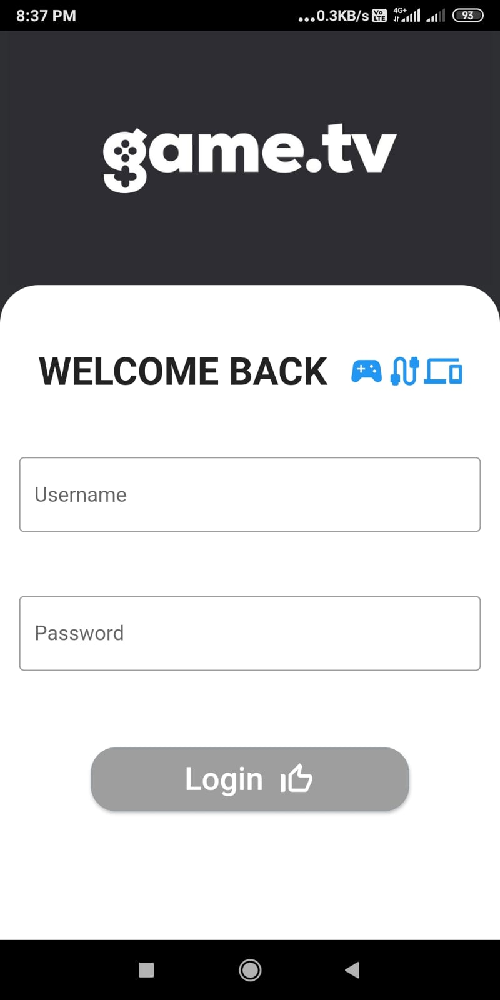
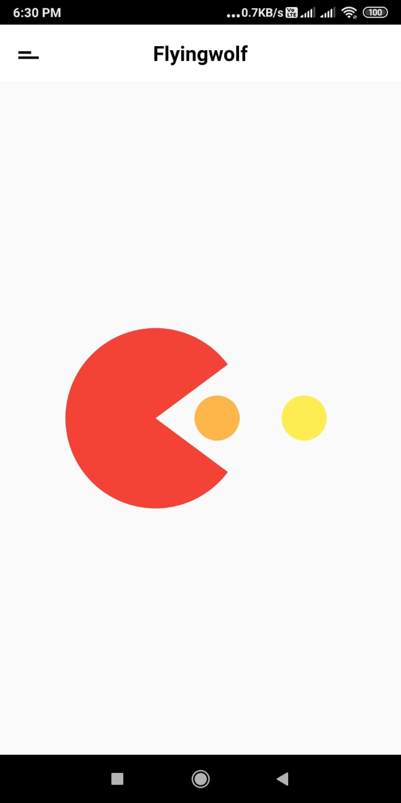
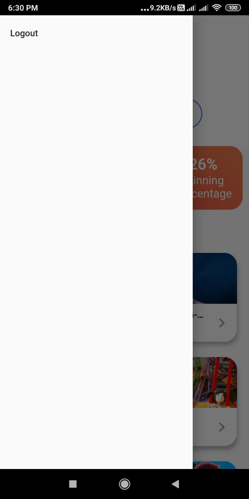

# Assignment

This is an assignment for a Flutter app with two screens.

## Getting Started

##App link 

https://github.com/abhey-sujith/assessment/blob/main/abhey_bluestack_assessment_app.apk

##App Flow

